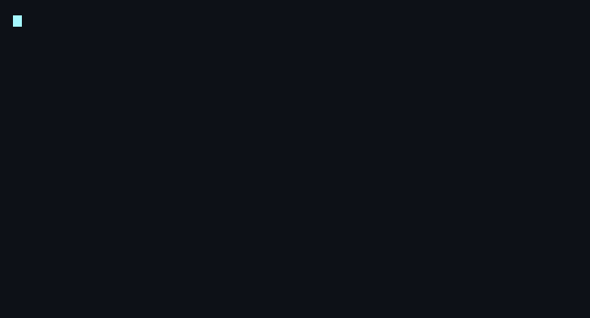

<!--
  README do perfil do GitHub de Gabriel Lauxen.
  Este arquivo deve ficar no repositório especial: itslauxen/itslauxen
  (o nome do repo TEM que ser igual ao seu username pro GitHub mostrar no perfil).
  Veja SETUP.md para o passo a passo.
-->



<a href="https://lauxen.dev"></a>

<br clear="all"/>

<div align="left">

<a href="https://www.linkedin.com/in/gabriel-lauxen-36822a231/"></a> &nbsp;<a href="https://github.com/itslauxen"></a> &nbsp;<a href="https://lauxen.dev"></a> &nbsp;<a href="mailto:gabriellauxen11@gmail.com"></a>

</div>

## 🧠 About

Fullstack developer from **Novo Hamburgo, Brazil**, with ~4 years shipping web and mobile products end‑to‑end — from data model to pixel‑perfect UI.

Right now at **DKW System** I build a large‑scale white‑label **CRM & messaging platform** (6 repos, front to back). A few things I'm proud of:

- 🚀 **Led a full frontend migration solo** — React 16→18, Node 16→22, Material UI v4→v5 and Vite — refactoring **thousands of files** and greatly improving performance.
- 🤖 Building configurable **AI agents with tools** (function calling), front and back, for per‑client automations.
- 🎨 Introduced the team's frontend **conventions, design tokens and code standards**.

On the side I designed and shipped **[Nova Notes](https://novanotes.lauxen.dev)** by myself — a PWA "second brain" with a Notion‑style block editor, multi‑provider AI and self‑built Web Push. I also spent ~6 months in Australia on an English immersion, so I'm comfortable in global teams.

I care about readable code, sensible defaults, and software that's still easy to maintain six months later.

> *"Make it work, make it right, make it fast — in that order."* — Kent Beck

---

## 🛠️ Tech Stack

**Languages**


**Frontend**


**Backend & Data**


**AI & Tooling**


---

## 🐍 Contribution Snake

<div align="center">


</div>

---

## 🚀 Featured Projects

| Project | What it is | Stack |
|---|---|---|
| **[Nova Notes](https://novanotes.lauxen.dev)** · _pre‑release_ | A PWA "second brain": Notion‑style block editor, multi‑provider AI (OpenAI/Groq/Gemini), self‑built Web Push notifications. Built solo, end‑to‑end. | React · Vite · Supabase |
| **[Portfolio + Component Library](https://lauxen.dev)** | A curated library of parameterizable UI components — some from favorite libs, others built from scratch — with effects in CSS, WebGL, Canvas and GSAP. | React · WebGL · Canvas · GSAP |

---

## ☕ Coffee-driven development

```ts
while (coffee) {
  code();
  if (bug) debug();
  coffee--;
}
refill(); // and repeat
```

---

<div align="center">

*Open to interesting problems and collaborations.*

**Reach out via [LinkedIn](https://www.linkedin.com/in/gabriel-lauxen-36822a231/) · [lauxen.dev](https://lauxen.dev) · [email](mailto:gabriellauxen11@gmail.com)**

</div>
